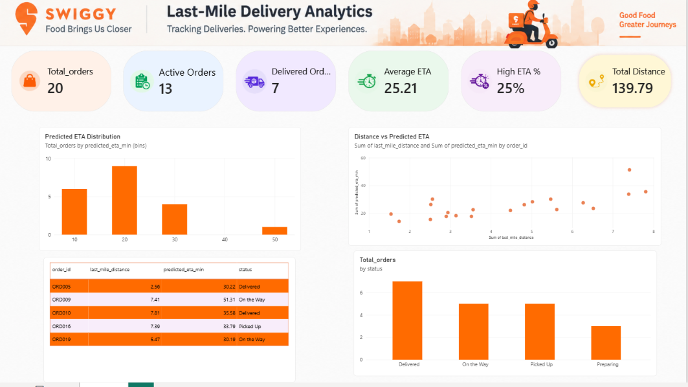

# Real-Time Food Delivery ETA Prediction and Analytics System

## 📖 Overview

Real-Time Food Delivery ETA Prediction and Analytics System is a Machine Learning and Data Analytics project designed to predict food delivery time and monitor simulated live delivery orders.

The project uses historical food delivery data to train machine learning models and provides an interactive Streamlit dashboard for monitoring delivery orders, predicted ETA, order status, distance analysis, and potentially delayed orders.

---

## ✨ Features

- Food Delivery ETA Prediction
- Machine Learning-based Prediction
- Random Forest Regression
- XGBoost Regression
- Real-Time Simulated Order Monitoring
- Streamlit Dashboard
- Predicted Delivery ETA
- Live Orders Monitoring
- Order Status Analysis
- Distance vs Predicted ETA Visualization
- High ETA Order Detection
- Manual ETA Prediction
- Interactive Dashboard
- Dashboard Refresh Functionality

---

## 🛠 Technologies Used

- Python
- Pandas
- NumPy
- Scikit-learn
- XGBoost
- Streamlit
- Plotly
- Joblib
- Jupyter Notebook

---

## 📂 Project Structure

Food-Delivery-ETA-Prediction/
│
├── app.py
├── Food_Delivery_ETA.ipynb
├── food_delivery_eta_model.pkl
├── model_features.pkl
├── live_orders.csv
├── Rider-Info.csv
├── dashboard.png
├── requirements.txt
└── README.md

---

## 📊 Dataset

The project uses historical food delivery order and rider information.

### Important Features

- First-mile distance
- Last-mile distance
- Allotted orders
- Delivered orders
- Undelivered orders
- Lifetime order count
- Session time
- Reassigned order
- Order hour
- Day of week
- Weekend indicator
- Peak-hour indicator

### Rider Information Dataset

Due to the large file size, `Rider-Info.csv` is hosted externally.

[Download Rider-Info.csv](https://1drv.ms/x/c/a4af5d16911d44d7/IQAe4jCVi6DbQZFmwZ4jneQgATAS5Wb3nlKiEfpNB6hoyE0?e=4OeXbj)

---

## 🧹 Data Preprocessing

The following preprocessing steps were performed:

1. Converted timestamp columns into datetime format
2. Handled missing values
3. Removed cancelled orders
4. Removed records without pickup or delivery timestamps
5. Created delivery time as the prediction target
6. Removed unrealistic delivery-time outliers
7. Created time-based features
8. Filled remaining numerical missing values using median values

---

## 🤖 Machine Learning

Two regression models were evaluated:

### Random Forest Regressor

- MAE: 5.37 minutes
- RMSE: 8.05 minutes
- R²: 0.218

### XGBoost Regressor

- MAE: 5.09 minutes
- RMSE: 7.80 minutes
- R²: 0.266

XGBoost was selected as the final model because it performed better than the Random Forest baseline.

---

## 📈 Model Performance

The final XGBoost model achieved an average absolute prediction error of approximately 5.09 minutes on the test dataset.

The model explains approximately 26.6% of the variance in delivery time.

| Metric | XGBoost |
|---|---:|
| MAE | 5.09 minutes |
| RMSE | 7.80 minutes |
| R² | 0.266 |

---

## 📊 Dashboard Features

The Streamlit dashboard provides:

- Total Orders
- Active Orders
- Delivered Orders
- Average ETA
- High ETA Percentage
- Total Distance
- Live Orders Table
- Predicted ETA Distribution
- Order Status Summary
- Distance vs Predicted ETA Visualization
- High ETA Orders Table
- Manual ETA Prediction Form
- Dashboard Refresh Functionality

---

## 📸 Dashboard Preview



The dashboard displays simulated delivery analytics including total orders, active orders, delivered orders, average ETA, high ETA percentage, total distance, predicted ETA distribution, distance analysis, and order status.

---

## 🎯 Workflow

Historical Food Delivery Data
            ↓
Data Preprocessing
            ↓
Feature Engineering
            ↓
Machine Learning Models
            ↓
Model Evaluation
            ↓
XGBoost Model
            ↓
Streamlit Dashboard
            ↓
ETA Prediction & Live Order Monitoring

---

## 🚀 Installation

### 1. Clone Repository

```bash
git clone https://github.com/abarna1111/Food-Delivery-ETA-Prediction.git
2. Navigate to Project Folder
cd Food-Delivery-ETA-Prediction
3. Install Dependencies
pip install -r requirements.txt
▶️ Run the Dashboard

Start the Streamlit application using:

streamlit run app.py

The dashboard provides simulated live order monitoring and delivery ETA prediction.

🔮 Manual ETA Prediction

The dashboard provides a manual ETA prediction section where users can enter delivery-related features such as:

First-Mile Distance
Last-Mile Distance
Allotted Orders
Delivered Orders
Undelivered Orders
Lifetime Order Count
Session Time
Reassigned Order
Order Hour
Day of Week
Weekend
Peak Hour

The trained machine learning model then predicts the estimated delivery time in minutes.

📈 Results

The project provides:

Food delivery ETA prediction
Machine learning model comparison
Simulated live order monitoring
Delivery status analysis
High ETA order identification
Distance-based ETA visualization
Interactive Streamlit dashboard
⚠️ Project Limitation

Actual Swiggy operational/live data is not publicly available for this project.

Historical delivery data was used for model training, and simulated live orders were used to demonstrate the real-time dashboard.

🔮 Future Enhancements
Real-time traffic data integration
Real-time weather data integration
Live rider GPS information
Database integration
Automated model retraining
Improved ETA prediction accuracy
Real-time delivery tracking
📦 Project Files

app.py
Food_Delivery_ETA.ipynb
food_delivery_eta_model.pkl
model_features.pkl
live_orders.csv
Rider-Info.csv
dashboard.png
requirements.txt
README.md

🎓 Project Type

Python Data Analytics + Machine Learning + Streamlit Dashboard

📄 License

This project is intended for educational and portfolio purposes.

👩‍💻 Author

Abarna
